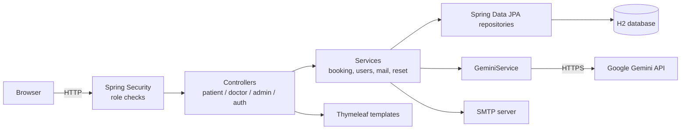

# MediBook — Hospital Appointment Booking System


MediBook is a server-rendered hospital appointment platform with three distinct role areas. **Patients** book and manage appointments, **doctors** manage their schedules, and **admins** oversee users, doctors and feedback. It also includes an AI feature that suggests the right medical service from a patient's described symptoms.

Built as a team project with Spring Boot, Spring Security, JPA and Thymeleaf.

---

## Table of contents

- [The problem it solves](#the-problem-it-solves)
- [Features](#features)
- [Tech stack](#tech-stack)
- [Architecture](#architecture)
- [Getting started](#getting-started)
- [Configuration](#configuration)
- [Demo accounts](#demo-accounts)
- [Project structure](#project-structure)
- [Design decisions](#design-decisions)
- [Known limitations and next steps](#known-limitations-and-next-steps)
- [My contribution](#my-contribution)

---

## The problem it solves

Booking a hospital appointment usually means phone calls and back-and-forth. MediBook puts the whole flow in one place: patients choose a doctor and book, doctors control their own availability, and admins keep the system clean. The AI suggestion helps patients who aren't sure which service to book.

## Features

**Role-based access (Patient, Doctor, Admin)**
- Three roles (`PATIENT`, `DOCTOR`, `ADMIN`) enforced by Spring Security.
- Each role has its own controllers and views, so one role cannot reach another's pages.

**Patients**
- Register, log in and book appointments with doctors.
- Manage their own appointments.
- Leave feedback.

**Doctors**
- Manage their own schedule and appointments.

**Admins**
- Oversee users, doctors and feedback.

**Password reset by email**
- Single-use, expiring tokens (`PasswordResetToken`) sent over SMTP.

**AI service recommendation**
- A patient describes their symptoms, and `GeminiService` calls Google Gemini to suggest the most suitable service.
- Degrades gracefully: without an API key, the AI suggestion is skipped and the rest of the app still works.

**Data model**
- Users, doctors, appointments, medication, feedback and reset tokens are modelled with JPA.

## Tech stack

| Layer | Choice |
| --- | --- |
| Language | Java 17 |
| Framework | Spring Boot 3.2 |
| Security | Spring Security + `thymeleaf-extras-springsecurity6` |
| Persistence | Spring Data JPA over H2 (file-backed) |
| Views | Thymeleaf (server-side rendering) |
| Mail | Spring Boot Mail (SMTP) |
| AI | Google Gemini via its OpenAI-compatible endpoint (OkHttp) |
| Build | Maven |

## Architecture

A classic layered Spring MVC design. Controllers handle HTTP and render Thymeleaf views, services hold the business logic, and repositories talk to the database through JPA.



## Getting started

**Prerequisites:** Java 17+ and Maven.

```bash
# 1. Clone
git clone https://github.com/DitiroMoabelo/MediBook.git
cd MediBook

# 2. Set configuration (all optional for a basic run, see Configuration below)
export GEMINI_API_KEY=your-key
export MAIL_USERNAME=your@gmail.com
export MAIL_PASSWORD=your-app-password

# 3. Run
mvn spring-boot:run
```

Open <http://localhost:8080>.

The H2 database is created on first run under `data/` (gitignored). The H2 console is available at `/h2-console`.

## Configuration

No secrets are committed. Every credential is read from the environment. See [`.env.example`](.env.example) for the full list.

| Variable | Purpose |
| --- | --- |
| `GEMINI_API_KEY` | Google AI Studio key for the recommendation feature |
| `MAIL_USERNAME` | SMTP account used as the sender for password-reset mail |
| `MAIL_PASSWORD` | Google **app password**, not the account password |
| `DB_PASSWORD` | Local H2 datasource password |

## Demo accounts

`DataInitializer` seeds demo data on first run.

| Role | Email | Password |
| --- | --- | --- |
| Admin | `admin@medbook.com` | `admin123` |
| Doctor | `dr.smith@medbook.com` (plus nine more `dr.*@medbook.com`) | `password123` |

These are local development accounts only.

## Project structure

```
src/main/java/com/medbook/
├── config/       # Security config, user details service, data seeding
├── controller/   # Auth, patient, doctor, admin, home, contact
├── entity/       # User, Doctor, Appointment, Medication, Feedback, PasswordResetToken
├── repository/   # Spring Data JPA repositories
└── service/      # Booking, users, mail, password reset, Gemini integration
src/main/resources/
├── templates/    # Thymeleaf views
└── static/       # Images and assets
```

## Design decisions

- **Server-side rendering with Thymeleaf** keeps the app simple and lets Spring Security's view integration show or hide UI by role without a separate frontend.
- **Layered architecture** (controller, service, repository) keeps HTTP, business rules and persistence separate and easy to reason about.
- **Secrets from environment variables** so no credentials live in source control, with `.env.example` documenting what is needed.
- **Single-use, expiring reset tokens** so a leaked reset link is only briefly useful.
- **AI as an optional enhancement.** The booking system does not depend on Gemini, so an API outage or missing key never blocks core functionality.
- **File-backed H2** for zero-setup local development. Swapping to PostgreSQL or MySQL would mainly be a datasource change thanks to JPA.

## Known limitations and next steps

- **Local only.** There is no hosted instance yet.
- **Slow first start.** Seeding registers each demo doctor one at a time and tries to email each a welcome message. Without SMTP credentials it logs a stack trace per doctor, but seeding still completes.
- **Logging.** Some authentication paths print diagnostics to stdout and should move to a proper logger with levels.

**Ideas for next steps**
- Move to PostgreSQL and add Docker Compose for one-command setup.
- Add automated tests (unit tests for services, MVC tests for role access).
- Send seeding emails asynchronously, or skip them when SMTP isn't configured.
- Add appointment reminders by email.

## My contribution

> _Replace this section with 3–4 bullets on what **you** built, for example the modules you owned, the hardest bug you fixed, and one thing you'd do differently. Interviewers will read this first._

---

## License

_Add a license (for example MIT) if you want others to reuse the code._
